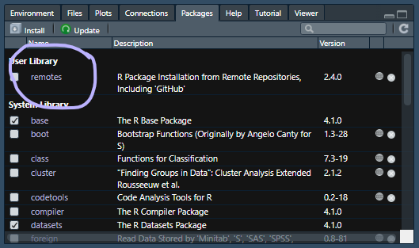

# Install everything  {#install-everything}

```{r echo = FALSE}
library(knitr)
opts_knit$set(root.dir = rprojroot::find_rstudio_root_file())
opts_chunk$set(echo = FALSE) 
knit_hooks$set(inline = function(x) {
        if (!is.numeric(x)) { 
                x 
        } else if (x >= 10000) { 
                prettyNum(round(x, 2), big.mark = ",")
        } else {
                prettyNum(round(x, 2))
        }
})
```

```{r}
htmltools::img(src = knitr::include_graphics("figures/logo-R.png"), 
        alt    = "logo", 
        style  = "left:0px; padding:5px;", 
        height = "110px")
htmltools::img(src = knitr::include_graphics("figures/logo-RStudio.png"), 
        alt    = "logo", 
        style  = "left:0px; padding:5px;", 
        height = "110px")
```

If you are trying R for the first time, it is vital that you attempt to set up your computer with the necessary software in advance or it will be difficult to keep up. 

Your pre-workshop homework:  

- [Install R and RStudio]
- [Install the remotes package]
- [Install midfielddata] 
- [Install midfieldr] 
- [Create a project]  
- [Add some folders] 

If you already have R and RStudio installed, this is a great time to 

- Make sure your R installation is current
- Make sure your RStudio installation is current
- Update your packages by running: 

```r
update.packages(ask = FALSE, checkBuilt = TRUE)

```


## Install R and RStudio {-}

The first steps are to install R and RStudio. Windows users may have to login as an Administrator before installing the software. 

- [Install R](https://cloud.r-project.org){target="_blank"} for your operating system  
- [Install RStudio](https://www.rstudio.com/products/rstudio/#Desktop){target="_blank"}, a user interface for R  

Once the installation is complete, you can take a 2-minute tour of the RStudio interface.

- [Let's start (00:57--02:32)](https://www.youtube.com/embed/kfcX5DEMAp4?start=57&end=152){target="_blank"} by R Ladies Sydney [@RLadiesSydney:2018:Lesson1]   

The same video includes a longer (7 minute) tour of the four quadrants (panes) in RStudio if you are interested. 

- [The RStudio quadrants (07:21--14:40)](https://www.youtube.com/embed/kfcX5DEMAp4?start=441&end=880){target="_blank"} by R Ladies Sydney [@RLadiesSydney:2018:Lesson1] 


## Install the remotes package {-}

The fundamental unit of shareable code in R is the *package.* For the R novice, an R package is like an "app" for R---a collection of functions, data, and documentation for doing work in R that is easily shared with others  [@wickham2014advanced]. 

Most packages are obtained from the [CRAN](https://cran.r-project.org/){target="_blank"} website [@cranweb]. To install a CRAN package using RStudio:

- Launch RStudio 

The RStudio interface has several panes. We want the *Files/Plots/Packages* pane. 

- Select the *Packages*  tab  

```{r echo = FALSE}
htmltools::img(src = knitr::include_graphics("figures/rstudio-packages.png"), 
        alt   = "rstudio packages pane", 
        style = "left:0px; padding:20px;", 
        width = "700px")
```

<br>
Next, 

- Click *Install* on the ribbon 
- In the dialog box, type the name of the package. For our first package, type  `remotes` to install the remotes package [@R-remotes]
- Check the *Install dependencies* box 
- Click the  *Install* button 

In the RStudio Console, you should see a message like this one,  

```r
    package 'remotes' successfully unpacked and MD5 sums checked
```

If successful, the package will appear in the Packages pane, e.g., 

```{r echo = FALSE}
htmltools::img(src = , 
        alt   = "rstudio packages pane", 
        style = "left:0px; padding:20px;", 
        width = "700px")
```


## Install midfielddata {-}

Install the midfielddata package first [@R-midfielddata]. 

Because of its size, the data package is stored in a `drat` repository instead of CRAN. Installation takes time; please be patient and wait for the Console prompt ">" to reappear. 

Type (or copy and paste) the following lines in the RStudio Console. 

```r
# type in the RStudio Console  
install.packages("midfielddata", 
                 repos = "https://MIDFIELDR.github.io/drat/", 
                 type = "source")
# be patient
```

Once the Console prompt ">" reappears, you can confirm a successful installation by viewing the package help page. In the Console, run:

```r
# type in the RStudio Console  
library("midfielddata")
? midfielddata
```

If the installation is successful, the code chunk above should produce a view of the help page as shown here.  If this step is successful, you can go on to the next step. 

```{r echo = FALSE}
htmltools::img(src = knitr::include_graphics("figures/README-midfielddata-help-page-2.png"), 
        alt   = "midfiedldata help page pane", 
        style = "left:0px; padding:20px;", 
        width = "700px")
```

## Install midfieldr {-}

Earlier we installed the remotes package. To access its functions we use the `library()` function. 

```r
# type in the RStudio Console  
library("remotes")
```

Now we can use the `install_github()` function in the remotes package to install the midfieldr package from GitHub [@R-midfieldr].

```r
# type in the RStudio Console  
install_github("MIDFIELDR/midfieldr")
```

You can confirm a successful installation by viewing the package help page. In the Console, run:

```r
# type in the RStudio Console 
library("midfieldr")
? midfieldr
```

If the installation is successful, the code chunk above should produce a view of the help page as shown here. 

```{r echo = FALSE}
htmltools::img(src = knitr::include_graphics("figures/README-midfieldr-help-page-2.png"), 
        alt   = "midfiedr help page pane", 
        style = "left:0px; padding:20px;", 
        width = "700px")
```

## Create a project {-}

To begin any project, we create an RStudio *Project* file and directory. You can recognize an R project file by its *.Rproj* suffix. 

If you prefer your instructions with commentary, 

- [Start with a Project (02:34--04:50)](https://www.youtube.com/embed/kfcX5DEMAp4?start=154&end=290){target="_blank"} by R Ladies Sydney [@RLadiesSydney:2018:Lesson1] 


If you prefer basic written instructions, 

- RStudio, *File &gt; New Project... &gt; New Directory &gt; New Project* 
- Or, click the *New Project* button in the Console ribbon, 


```{r echo = FALSE}
htmltools::img(src = knitr::include_graphics("figures/rstudio-new-project.png"), 
        alt   = "rstudio new project button", 
        style = "left:0px; padding:20px;", 
        width = "700px")
```

<br>
In the dialog box that appears, 
  
- Type the workshop name as the directory name, for example, `workshop`, or if you like more detail, `midfield-workshop-asee-2021`    
- Use the browse button to select a location on your computer to create the project  folder  
- Click the *Create Project* button  
 


Whenever you work with the workshop materials, launch the `workshop.Rproj` file (using the name you actually used) to start the session. 


## Add some folders {-}

While file organization is a matter of personal preference, we ask that you use the directory structure shown here for your work in the workshop. Assuming we called our project `workshop`, the minimal directory structure has three folders in it plus the `.Rproj` file at the top level. 

`r "\U2003"`                          `workshop\`  
`r "\U2003\U2003\U2003\U251C\U2500"`  `data\`  
`r "\U2003\U2003\U2003\U251C\U2500"`  `results\`  
`r "\U2003\U2003\U2003\U251C\U2500"`  `scripts\`  
`r "\U2003\U2003\U2003\U2514\U2500"`  `workshop.Rproj`  
`r "\U2003"`


If you prefer your instructions with commentary,  

- [Make some folders  (04:50--06:08)](https://www.youtube.com/embed/kfcX5DEMAp4?start=290&end=368){target="_blank"} by R Ladies Sydney [@RLadiesSydney:2018:Lesson1] 

If you prefer basic written instructions, 

- use your usual method of creating new folders on your machine 
- or you can use the *New Folder* button in the Files pane 

```{r echo = FALSE}
htmltools::img(src = knitr::include_graphics("figures/rstudio-new-folder.png"), 
        alt   = "rstudio new folder", 
        style = "left:0px; padding:20px;", 
        width = "700px")
```

<br>
We use the folders as follows: 

- `data` for data files 
- `figures` for finished data displays  
- `scripts` for R scripts that operate on data to produce results  


You finished your homework!


## References {-}

<div id="refs"></div>


<br>
[&#9650; top of page](#get-start-r)
