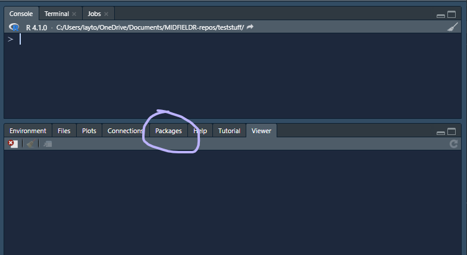
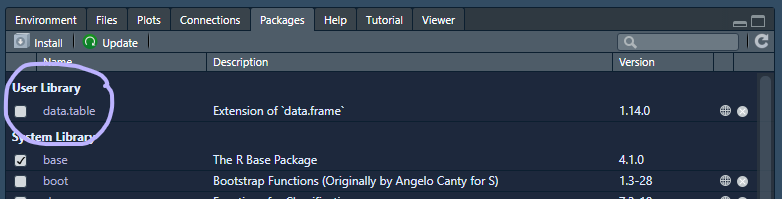
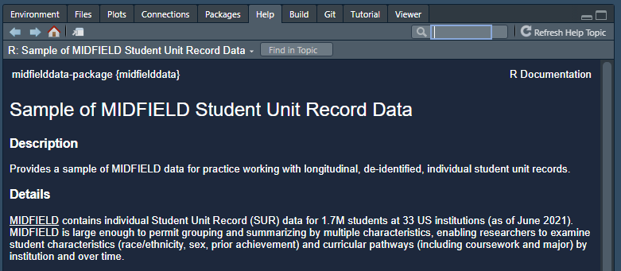

# Install everything {#install-everything}

```{r echo = FALSE}
source("utils.R")
```

```{r echo = FALSE}
htmltools::img(src = knitr::include_graphics("figures/logo-R.png"), 
        alt    = "logo", 
        style  = "left:0px; padding:5px;", 
        height = "110px")
htmltools::img(src = knitr::include_graphics("figures/logo-RStudio.png"), 
        alt    = "logo", 
        style  = "left:0px; padding:5px;", 
        height = "110px")
htmltools::img(src = knitr::include_graphics("figures/data.table-logo.png"), 
        alt    = "logo", 
        style  = "left:0px; padding:5px;", 
        height = "110px")
htmltools::img(src = knitr::include_graphics("figures/ggplot2-logo.png"), 
        alt    = "logo", 
        style  = "left:0px; padding:5px;", 
        height = "110px")
htmltools::img(src = knitr::include_graphics("figures/midfieldr-logo.svg"), 
        alt    = "logo", 
        style  = "left:0px; padding:5px;", 
        height = "110px")
htmltools::img(src = knitr::include_graphics("figures/midfielddata-logo.svg"), 
        alt    = "logo", 
        style  = "left:0px; padding:5px;", 
        height = "110px")
```

If you are trying R for the first time, it is vital that you attempt to set up your computer with the necessary software in advance or it will be difficult to keep up. 

This chapter describes all of the pre-workshop homework: 

- [Already installed?]
- [Install R and RStudio]
- [Create a project]  
- [Add some folders] 
- [Install CRAN packages] 
- [Install midfieldr] 
- [Install midfielddata] 


## Already installed?

If you do not have R and RStudio installed, please skip this section and start with the next section. If you are already an R and RStudio user, this is a great time to check for updates. 

**Updating RStudio**

- RStudio menu *Help \> Check for Updates* will tell you if you are current or not. 
- To update, close RStudio on your machine, download the new version from the [RStudio website](https://www.rstudio.com/products/rstudio/#Desktop), and run the `RStudio-some-version-number.exe`. (Windows users *might* have to run the executable as an administrator.)

**Update your packages**

[How to upgrade all out-of-date packages](https://rstats.wtf/maintaining-r.html#how-to-upgrade-all-out-of-date-packages) in *What They Forgot to Teach You About R* by Jennifer Bryan and Jim Hester. 


**Updating R**

The easiest way to update R is to simply [download the newest version](https://cloud.r-project.org/). RStudio will automatically use the latest you've installed. 


Alternatively, Windows users can use the installr package:

- Install the installr package 
- If open, close R and RStudio 
- Navigate to your most recent `Rgui.exe` file located in your Programs directory, e.g., `C:\Program Files\R\R-4.0.0\bin\x64\Rgui.exe`  
- Right-click on `Rgui.exe` and run as administrator
- In the R GUI window that appears, run the commands

``` r
    # Windows users only
    library("installr")
    updateR()
```


**Updating your R library**

[How to transfer your library when updating R](https://rstats.wtf/maintaining-r.html#how-to-transfer-your-library-when-updating-r) also by Bryan and Hester. Requires the fs package.  


**Once your updates are complete**

Skip the next section and continue the homework with 

- [Create a project]  
- [Add some folders] 
- [Install CRAN packages] 
- [Install midfieldr] 
- [Install midfielddata]


## Install R and RStudio 

The first steps are to install R and RStudio. Windows users may have to login as an Administrator before installing the software. 

- [Install R](https://cloud.r-project.org){target="_blank"} for your operating system  
- [Install RStudio](https://www.rstudio.com/products/rstudio/download/#download){target="_blank"}, a user interface for R


Once the installation is complete, you can take a 2-minute tour of the RStudio interface.

- [Let's start (00:57--02:32)](https://www.youtube.com/embed/kfcX5DEMAp4?start=57&end=152){target="_blank"} by R Ladies Sydney [@RLadiesSydney:2018:Lesson1]   

The same video includes a longer (7 minute) tour of the four quadrants (panes) in RStudio if you are interested. 

- [The RStudio quadrants (07:21--14:40)](https://www.youtube.com/embed/kfcX5DEMAp4?start=441&end=880){target="_blank"} by R Ladies Sydney [@RLadiesSydney:2018:Lesson1] 


## Create a project 

To begin any project, we create an RStudio *Project* file and directory. You can recognize an R project file by its *.Rproj* suffix. 

If you prefer your instructions with commentary, 

- [Start with a Project (02:34--04:50)](https://www.youtube.com/embed/kfcX5DEMAp4?start=154&end=290){target="_blank"} by R Ladies Sydney [@RLadiesSydney:2018:Lesson1] 


If you prefer basic written instructions, 

- RStudio, *File &gt; New Project... &gt; New Directory &gt; New Project* 
- Or, click the *New Project* button in the Console ribbon, 


```{r echo = FALSE}
htmltools::img(src = knitr::include_graphics("figures/rstudio-new-project.png"), 
        alt   = "rstudio new project button", 
        style = "left:0px; padding:20px;", 
        width = "700px")
```

<br>
In the dialog box that appears, 
  
- Type the workshop name as the directory name, for example, `workshop`, or if you like more detail, `midfield-workshop-asee-2021`    
- Use the browse button to select a location on your computer to create the project  folder  
- Click the *Create Project* button  
 


Whenever you work with the workshop materials, launch the `workshop.Rproj` file (using the name you actually used) to start the session. 


## Add some folders 

While file organization is a matter of personal preference, we ask that you use the directory structure shown here for your work in the workshop. Assuming we called our project `workshop`, the minimal directory structure has three folders in it plus the `.Rproj` file at the top level. 

```r
\workshop
    \data
    \results
    \scripts
    workshop.Rproj
```

We use the folders as follows: 

- `data` data files 
- `results` finished graphs and tabulated data formatted for display  
- `scripts` R scripts that operate on data to produce results  

To create folders: 

- use your usual method of creating new folders on your machine 
- or you can use the *New Folder* button in the Files pane 

```{r echo = FALSE}
htmltools::img(src = knitr::include_graphics("figures/rstudio-new-folder.png"), 
        alt   = "rstudio new folder", 
        style = "left:0px; padding:20px;", 
        width = "700px")
```
<br>

For a video guide, 

- [Make some folders  (04:50--06:08)](https://www.youtube.com/embed/kfcX5DEMAp4?start=290&end=368){target="_blank"} by R Ladies Sydney [@RLadiesSydney:2018:Lesson1] 


## Install CRAN packages

The fundamental unit of shareable code in R is the *package.* For the R novice, an R package is like an "app" for R---a collection of functions, data, and documentation for doing work in R that is easily shared with others  [@wickham2014advanced]. 

Most packages are obtained from the [CRAN](https://cran.r-project.org/){target="_blank"} website [@cranweb]. To install a CRAN package using RStudio:

- Launch RStudio 

The RStudio interface has several panes. We want the *Files/Plots/Packages* pane. 

- Select the *Packages*  tab  

```{r echo = FALSE}
htmltools::img(src = , 
        alt   = "rstudio packages pane", 
        style = "left:0px; padding:20px;", 
        width = "700px")
```

<br>
Next, 

- Click *Install* on the ribbon 
- In the dialog box, type the name of the package. For our first package, type  `data.table` to install the data.table package [@R-data.table]
- Check the *Install dependencies* box 
- Click the  *Install* button 


> During the installation, Windows users might get a warning message about 
> Rtools, something like:
>    
> `WARNING: Rtools is required to build R packages but is not currently installed. Please download and install the appropriate version...`. 
>    

Rtools is needed for packages with C/C++/FORTRAN code from source---which does not apply to us. You may ignore the warning and carry on. 


In the RStudio Console, you should see a message like this one,  

```r
    package 'data.table' successfully unpacked and MD5 sums checked
```

If successful, the package will appear in the Packages pane, e.g., 

```{r echo = FALSE}
htmltools::img(src = , 
        alt   = "rstudio packages pane", 
        style = "left:0px; padding:20px;", 
        width = "700px")
```

Repeat the process for the following packages

    wrapr 
    Rdpack 
    checkmate
    ggplot2

Alternatively, you can install them all at once by typing in the Console: 

``` r
packages_we_use <- c("data.table", "wrapr", "Rdpack", "checkmate", "ggplot2")
install.packages(packages_we_use)
```


## Install midfieldr

midfieldr is not yet available from [CRAN](https://cran.r-project.org/). To install the development version of midfieldr from its `drat` repository, type in the Console: 

``` r
# type in the RStudio Console 
install.packages("midfieldr", 
                 repos = "https://MIDFIELDR.github.io/drat/", 
                 type = "source")
```

You can confirm a successful installation by running the following lines to bring up the package help page in the Help window. 

``` r
# type in the RStudio Console 
library("midfieldr")
? `midfieldr-package`

# or, equivalently
help("midfieldr-package")
```

If the installation is successful, the code chunk above should produce a view of the help page as shown here. 

```{r echo = FALSE}
htmltools::img(src = knitr::include_graphics("figures/README-midfieldr-help-page-2.png"), 
        alt   = "midfiedr help page pane", 
        style = "left:0px; padding:20px;", 
        width = "700px")
```

## Install midfielddata

Because of its size, the data package is stored in a `drat` repository instead of CRAN. Installation takes time; please be patient and wait for the Console prompt ">" to reappear. 

Type (or copy and paste) the following lines in the RStudio Console. 

```r
# type in the RStudio Console  
install.packages("midfielddata", 
                 repos = "https://MIDFIELDR.github.io/drat/", 
                 type = "source")
# be patient
```

Once the Console prompt ">" reappears, you can confirm a successful installation by viewing the package help page. In the Console, run:

```r
# type in the RStudio Console  
library("midfielddata")
help("midfielddata-package")
```

If the installation is successful, the code chunk above should produce a view of the help page as shown here.  

```{r echo = FALSE}
htmltools::img(src = , 
        alt   = "midfiedldata help page pane", 
        style = "left:0px; padding:20px;", 
        width = "700px")
```


## Exiting R and RStudio

When you exit R/RStudio, you probably get a prompt about saving your workspace image. 

The answer is No.  

You can turn this prompt off by using the pulldown menu, 

- _Tools &gt; Global Options..._
- In the dialog box, _Save workspace to .RData on exit:_ Select "Never"


You finished your homework!


<br>
[&#9650; top of page](#install-everything)
